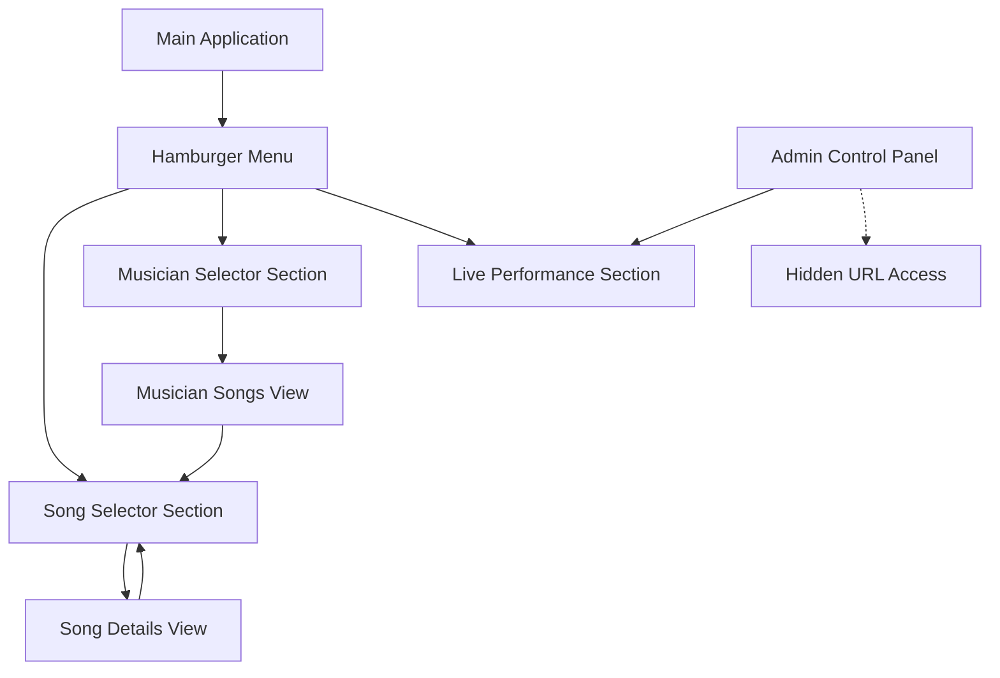

# Design Document: Multilingual Menu Enhancement

## Overview

This design document outlines the comprehensive enhancement of the existing Musician Song Selector application to include a hamburger-style navigation menu system, complete Spanish language support, black color theme, and additional functionality for musician management and live performance tracking. The solution builds upon the existing Flask application architecture while adding new views, navigation patterns, and administrative capabilities.

## Architecture

### System Architecture

The enhanced application maintains the existing Flask-based architecture with the following additions:

```
┌─────────────────────────────────────────────────────────────┐
│                    Flask Application                        │
├─────────────────────────────────────────────────────────────┤
│  Routes:                                                    │
│  • / (Main App with Menu System)                          │
│  • /api/songs (Existing)                                  │
│  • /api/song/<id> (Existing)                             │
│  • /api/musicians (New)                                   │
│  • /api/musician/<id> (New)                              │
│  • /api/live-performance (New)                           │
│  • /admin/control (New - Hidden)                         │
├─────────────────────────────────────────────────────────────┤
│  Frontend Components:                                       │
│  • Hamburger Menu System                                  │
│  • Song Selector Section (Enhanced)                       │
│  • Musician Selector Section (New)                        │
│  • Live Performance Section (New)                         │
│  • Admin Control Panel (New)                              │
├─────────────────────────────────────────────────────────────┤
│  Data Layer:                                               │
│  • CSVDataProcessor (Enhanced)                            │
│  • Live Performance State Manager (New)                   │
│  • Spanish Translation System (New)                       │
└─────────────────────────────────────────────────────────────┘
```

### Navigation Architecture

The application uses a single-page architecture with JavaScript-based section switching:



## Components and Interfaces

### 1. Hamburger Menu System

**Purpose**: Provides navigation between the three main application sections

**Implementation**:
- CSS-based hamburger icon with three horizontal lines
- JavaScript toggle functionality for menu expansion/collapse
- Responsive design that adapts to different screen sizes
- Click-outside-to-close functionality

**HTML Structure**:
```html
<nav class="hamburger-menu">
  <button class="menu-toggle" aria-label="Abrir menú de navegación">
    <span class="hamburger-line"></span>
    <span class="hamburger-line"></span>
    <span class="hamburger-line"></span>
  </button>
  <div class="menu-overlay">
    <ul class="menu-items">
      <li><a href="#song-selector">Selector de Canciones</a></li>
      <li><a href="#musician-selector">Selector de Músicos</a></li>
      <li><a href="#live-performance">Presentación en Vivo</a></li>
    </ul>
  </div>
</nav>
```

### 2. Enhanced Song Selector Section

**Purpose**: Maintains existing functionality within the new menu system

**Enhancements**:
- Spanish language labels and text
- Integration with menu navigation
- Black theme styling
- Cross-linking to other sections

**Key Features**:
- Dropdown song selection (existing functionality)
- Musician assignment display (existing functionality)
- Link forwarding to musician selector for specific musicians
- Spanish translations for all interface elements

### 3. Musician Selector Section

**Purpose**: Allows users to select musicians and view their song assignments

**Implementation**:
- Musician dropdown populated from CSV data
- Dynamic song list display for selected musician
- Song details including duration and instruments played
- Forward links to song selector section

**API Endpoint**: `/api/musicians`
```json
{
  "musicians": [
    {"id": "musician_1", "name": "Juan Pérez"},
    {"id": "musician_2", "name": "María García"}
  ]
}
```

**API Endpoint**: `/api/musician/<musician_id>`
```json
{
  "musician": "Juan Pérez",
  "songs": [
    {
      "id": "song_1",
      "title": "Canción Ejemplo",
      "duration": "3:45",
      "instruments": ["Guitarra", "Voz"]
    }
  ]
}
```

### 4. Live Performance Section

**Purpose**: Displays current and next song information for live performance tracking

**Features**:
- Current song display with all musician assignments
- Next song preview with musician assignments
- Real-time updates from admin control panel
- Performance status indicators

**State Management**:
- Server-side session storage for current/next song state
- API endpoint for retrieving live performance status
- WebSocket or polling for real-time updates (optional enhancement)

**API Endpoint**: `/api/live-performance`
```json
{
  "current_song": {
    "id": "song_1",
    "title": "Canción Actual",
    "musicians": [...]
  },
  "next_song": {
    "id": "song_2", 
    "title": "Próxima Canción",
    "musicians": [...]
  }
}
```

### 5. Admin Control Panel

**Purpose**: Hidden administrative interface for controlling live performance state

**Access**: Available only through direct URL (`/admin/control`)
**Features**:
- Dropdown for current song selection
- Dropdown for next song selection
- Immediate state updates
- Session persistence

**Security Considerations**:
- No authentication required (as specified)
- Hidden from main navigation
- URL-based access only

## Data Models

### Enhanced CSV Data Processor

The existing `CSVDataProcessor` class will be enhanced with new methods:

```python
class CSVDataProcessor:
    # Existing methods...
    
    def get_musicians_for_dropdown(self):
        """Return list of all musicians for dropdown population"""
        
    def get_musician_songs(self, musician_name):
        """Return all songs for a specific musician with instruments"""
        
    def get_musician_by_id(self, musician_id):
        """Return musician details by ID"""
        
    def format_musician_songs_display(self, musician_songs):
        """Format musician songs for frontend display"""
```

### Live Performance State Manager

New class for managing live performance state:

```python
class LivePerformanceManager:
    def __init__(self):
        self.current_song_id = None
        self.next_song_id = None
    
    def set_current_song(self, song_id):
        """Set the current playing song"""
        
    def set_next_song(self, song_id):
        """Set the next song in queue"""
        
    def get_performance_state(self):
        """Return current performance state"""
        
    def persist_state(self):
        """Persist state to session storage"""
```

### Spanish Translation System

Translation mapping for all UI elements:

```python
SPANISH_TRANSLATIONS = {
    # Navigation
    "song_selector": "Selector de Canciones",
    "musician_selector": "Selector de Músicos", 
    "live_performance": "Presentación en Vivo",
    
    # Common UI Elements
    "select_song": "Seleccionar una canción...",
    "select_musician": "Seleccionar un músico...",
    "loading": "Cargando...",
    "error": "Error",
    "duration": "Duración",
    "instruments": "Instrumentos",
    
    # Live Performance
    "current_song": "Canción Actual",
    "next_song": "Próxima Canción",
    "no_performance": "No hay presentación activa",
    
    # Admin Panel
    "admin_control": "Panel de Control",
    "set_current": "Establecer Actual",
    "set_next": "Establecer Siguiente"
}
```

## Correctness Properties

*A property is a characteristic or behavior that should hold true across all valid executions of a system-essentially, a formal statement about what the system should do. Properties serve as the bridge between human-readable specifications and machine-verifiable correctness guarantees.*

Based on the prework analysis of acceptance criteria, the following properties ensure system correctness:

### Property 1: Menu Navigation Behavior
*For any* menu section selection, clicking the menu item should navigate to that section, collapse the menu, and display the appropriate interface.
**Validates: Requirements 1.2, 1.4, 2.1, 3.1, 4.1**

### Property 2: Menu Interaction Consistency  
*For any* user interaction with the hamburger menu, clicking outside the expanded menu should collapse it automatically.
**Validates: Requirements 1.3**

### Property 3: Responsive Menu Functionality
*For any* screen size or viewport, the menu system should remain accessible and functional with appropriate touch-friendly interactions.
**Validates: Requirements 1.5, 10.1, 10.2**

### Property 4: Data Consistency Across Sections
*For any* musician or song data, the same information should appear consistently across all sections that display it.
**Validates: Requirements 9.1, 9.2, 9.4**

### Property 5: Musician Song Display Completeness
*For any* selected musician, all songs they perform should be displayed with complete information including title, duration, and instruments.
**Validates: Requirements 3.2, 3.3**

### Property 6: Live Performance State Synchronization
*For any* admin control panel changes to current or next song, the live performance section should update immediately to reflect those changes.
**Validates: Requirements 5.3, 5.4**

### Property 7: Spanish Language Compliance
*For any* user interface element, all text should be displayed in Spanish including labels, buttons, error messages, and navigation elements.
**Validates: Requirements 6.1, 6.2, 6.3, 6.4**

### Property 8: Black Theme Consistency
*For any* application section or component, the black-based color scheme should be applied consistently with sufficient contrast for accessibility.
**Validates: Requirements 8.1, 8.2, 8.3**

### Property 9: Cross-Section Navigation Links
*For any* song or musician displayed in any section, navigation links should exist and function correctly to forward users to related information in other sections.
**Validates: Requirements 2.5, 3.4**

### Property 10: Error Handling Consistency
*For any* data loading failure or missing data scenario, the application should handle errors gracefully across all sections.
**Validates: Requirements 9.3, 9.5**

### Property 11: Admin Panel Access Control
*For any* navigation attempt, the admin control panel should only be accessible through direct URL access and not through normal menu navigation.
**Validates: Requirements 5.1**

### Property 12: Session State Persistence
*For any* admin panel song selections, the choices should persist across browser sessions.
**Validates: Requirements 5.5**

### Property 13: Branding Consistency
*For any* application section, the "Rock and Roll Forum Jam en Español" branding should be displayed consistently.
**Validates: Requirements 7.3**

### Property 14: Responsive Design Preservation
*For any* new functionality added, existing responsive behavior should continue to work correctly across all device types.
**Validates: Requirements 10.3, 10.4**

<function_calls>
<invoke name="prework">
<parameter name="featureName">multilingual-menu-enhancement

## Error Handling

### Client-Side Error Handling

**Menu System Errors**:
- Handle cases where menu sections fail to load
- Provide fallback navigation if JavaScript fails
- Display appropriate Spanish error messages for navigation failures

**Data Loading Errors**:
- Graceful handling of API endpoint failures
- Spanish error messages for data loading issues
- Retry mechanisms for transient network failures
- Fallback to cached data when available

**State Management Errors**:
- Handle cases where live performance state becomes inconsistent
- Provide recovery mechanisms for corrupted session data
- Validate admin panel inputs before state updates

### Server-Side Error Handling

**API Endpoint Errors**:
- Proper HTTP status codes for different error conditions
- Consistent JSON error response format
- Logging of errors for debugging purposes
- Graceful degradation when CSV data is unavailable

**Session Management Errors**:
- Handle session storage failures for live performance state
- Provide default states when session data is corrupted
- Validate admin panel requests before processing

**Data Processing Errors**:
- Enhanced CSV processing error handling
- Validation of musician and song data integrity
- Handling of missing or malformed data entries

### Error Response Format

All API endpoints will return consistent error responses in Spanish:

```json
{
  "error": true,
  "message": "Mensaje de error en español",
  "code": "ERROR_CODE",
  "details": "Detalles adicionales si están disponibles"
}
```

## Testing Strategy

### Dual Testing Approach

The application will use both unit testing and property-based testing to ensure comprehensive coverage:

**Unit Tests**:
- Specific examples and edge cases for each component
- Integration points between menu system and existing functionality
- Error conditions and boundary cases
- Spanish translation accuracy for specific text elements

**Property-Based Tests**:
- Universal properties that hold across all inputs using Hypothesis
- Comprehensive input coverage through randomization
- Each property test will run minimum 100 iterations
- Tests will be tagged with feature and property references

### Property-Based Testing Configuration

Each correctness property will be implemented as a property-based test with the following configuration:

- **Testing Framework**: Hypothesis for Python
- **Minimum Iterations**: 100 per property test
- **Tag Format**: **Feature: multilingual-menu-enhancement, Property {number}: {property_text}**
- **Test Organization**: Property tests will be co-located with unit tests in test files

### Testing Areas

**Menu System Testing**:
- Hamburger menu toggle functionality across different screen sizes
- Navigation between sections with proper state management
- Responsive behavior validation
- Accessibility compliance testing

**Spanish Language Testing**:
- Validation that all UI text is in Spanish
- Consistency of translations across sections
- Error message language compliance
- Typography and character encoding validation

**Black Theme Testing**:
- Color contrast ratio validation (minimum 4.5:1 for normal text, 3:1 for large text)
- Theme consistency across all components
- Accessibility compliance with dark themes
- Visual regression testing for theme application

**Data Integration Testing**:
- Consistency of data across different sections
- Error handling for missing or corrupted data
- Performance testing for data loading operations
- Cache invalidation and refresh testing

**Live Performance Testing**:
- State synchronization between admin panel and live view
- Session persistence across browser restarts
- Real-time update functionality
- Error recovery for state corruption

**Responsive Design Testing**:
- Functionality across different viewport sizes
- Touch interaction testing on mobile devices
- Performance on various device types
- Backward compatibility with existing responsive features

### Test Environment Setup

**Development Testing**:
- Local Flask development server
- Test CSV data with known musician and song combinations
- Mock admin panel interactions
- Automated browser testing with Selenium

**Integration Testing**:
- Full application stack testing
- Real CSV data validation
- Cross-browser compatibility testing
- Performance benchmarking

**Accessibility Testing**:
- Screen reader compatibility
- Keyboard navigation testing
- Color contrast validation
- WCAG 2.1 AA compliance verification

The testing strategy ensures that all correctness properties are validated while maintaining the existing functionality and adding comprehensive coverage for the new features.