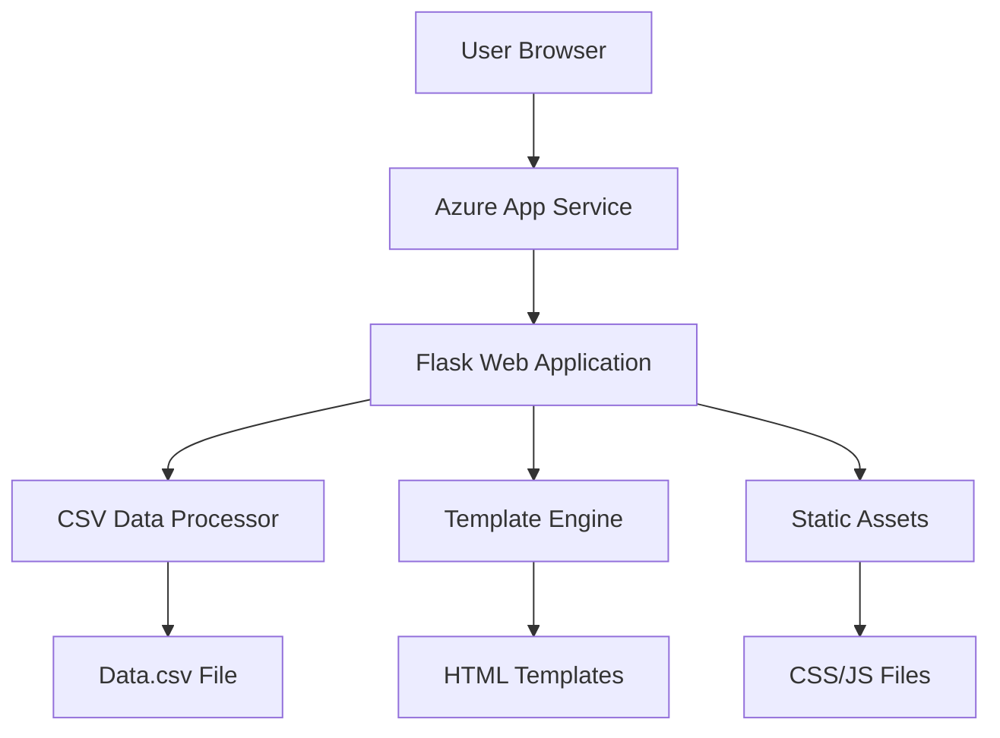

# Design Document: Musician Song Selector

## Overview

The Musician Song Selector is a responsive web application built with Python Flask that enables musicians to quickly identify their bandmates for specific songs. The application processes data from a static CSV file containing song assignments and presents it through an intuitive, mobile-first interface with a dark blue theme. The solution is designed for deployment on Azure App Service and optimized for both widescreen displays and mobile devices.

## Architecture

### High-Level Architecture



### Technology Stack

- **Backend Framework**: Flask (Python 3.9+)
- **Data Processing**: Python CSV module with Pandas for data manipulation
- **Frontend Framework**: Bootstrap 5 for responsive design
- **Template Engine**: Jinja2 (Flask default)
- **Deployment Platform**: Azure App Service
- **Static File Serving**: Flask static file handling

### Deployment Architecture

The application follows Azure App Service best practices:
- Main application file named `app.py` for Azure compatibility
- `requirements.txt` for dependency management
- Static files served through Flask's built-in static file handler
- CSV data file included as part of the application package

## Components and Interfaces

### 1. Data Processing Layer

**CSVDataProcessor Class**
```python
class CSVDataProcessor:
    def load_songs() -> List[Dict]
    def get_song_by_id(song_id: str) -> Dict
    def get_all_songs() -> List[Dict]
    def format_song_display(song_data: Dict) -> Dict
```

**Responsibilities:**
- Load and parse CSV data on application startup
- Cache processed data in memory for fast access
- Handle missing or empty instrument assignments
- Format data for frontend consumption

### 2. Web Application Layer

**Flask Application Structure**
```python
app = Flask(__name__)

@app.route('/')
def index() -> str

@app.route('/api/songs')
def get_songs() -> Response

@app.route('/api/song/<song_id>')
def get_song_details(song_id: str) -> Response
```

**Route Responsibilities:**
- `/`: Serve main application page with song selector interface
- `/api/songs`: Return JSON list of all songs for dropdown population
- `/api/song/<song_id>`: Return detailed musician assignments for selected song

### 3. Frontend Interface Layer

**Components:**
- **Song Selector Dropdown**: Bootstrap-styled select element with all available songs
- **Musician Assignment Display**: Responsive card layout showing instrument roles and assigned musicians
- **Loading States**: Visual feedback during data loading
- **Error Handling**: User-friendly error messages for data loading failures

**Responsive Breakpoints:**
- Mobile: < 768px (single column layout)
- Tablet: 768px - 1024px (optimized touch interface)
- Desktop: > 1024px (multi-column layout)

## Data Models

### Song Data Structure

```python
@dataclass
class Song:
    artist: str
    song: str
    lead_guitar: Optional[str]
    rhythm_guitar: Optional[str]
    bass: Optional[str]
    battery: Optional[str]  # Drums
    singer: Optional[str]
    keyboards: Optional[str]
    time: str
    song_id: str  # Generated unique identifier
```

### API Response Models

**Songs List Response:**
```json
{
  "songs": [
    {
      "song_id": "tras-las-puas-soy-latino",
      "display_name": "Tras las Puas - Soy latino",
      "artist": "Tras las Puas",
      "song": "Soy latino"
    }
  ]
}
```

**Song Details Response:**
```json
{
  "song_id": "tras-las-puas-soy-latino",
  "artist": "Tras las Puas",
  "song": "Soy latino",
  "time": "0:03:44",
  "assignments": {
    "Lead Guitar": "BRUWAR",
    "Rhythm Guitar": "AXEOCH",
    "Bass": "EMMARB",
    "Battery": "SHABER",
    "Singer": "AXEOCH",
    "Keyboards": null
  }
}
```

## Correctness Properties

*A property is a characteristic or behavior that should hold true across all valid executions of a system-essentially, a formal statement about what the system should do. Properties serve as the bridge between human-readable specifications and machine-verifiable correctness guarantees.*

### Converting EARS to Properties

Based on the prework analysis, the following properties validate the system's correctness:

**Property 1: Complete Data Loading**
*For any* valid CSV file with song data, the application should successfully load all song entries with their complete musician assignments and make them available for selection.
**Validates: Requirements 1.1, 1.2**

**Property 2: Graceful Empty Assignment Handling**
*For any* song with missing or empty instrument assignments, the system should display appropriate indicators without crashing or corrupting the display.
**Validates: Requirements 1.4**

**Property 3: Complete Song Display**
*For any* selected song, the display should show all instrument roles in the specified order (Lead Guitar, Rhythm Guitar, Bass, Battery, Singer, Keyboards), include assigned musician acronyms where present, indicate unassigned positions clearly, and display the song duration.
**Validates: Requirements 3.1, 3.2, 3.3, 3.4, 3.5**

**Property 4: Song Selection Consistency**
*For any* song selected from the dropdown, the displayed musician assignments should exactly match the data from the CSV file for that song.
**Validates: Requirements 2.2**

**Property 5: Dropdown Organization**
*For any* loaded song data, the dropdown should organize songs by artist and song title in a consistent, readable format.
**Validates: Requirements 2.3**

**Property 6: Responsive Layout Adaptation**
*For any* viewport size change or screen orientation change, the interface should adapt its layout appropriately while maintaining functionality and readability.
**Validates: Requirements 4.1, 4.2, 4.4**

**Property 7: Performance Response Time**
*For any* song selection operation, the display update should complete within 1 second.
**Validates: Requirements 6.1**

**Property 8: Visual Feedback Consistency**
*For any* data loading or processing operation, the system should provide clear visual feedback indicators.
**Validates: Requirements 6.2**

**Property 9: Color Contrast Accessibility**
*For any* text displayed against the dark blue background, the color contrast should meet accessibility standards for readability.
**Validates: Requirements 6.4, 6.5**

## Error Handling

### Data Loading Errors
- **File Not Found**: Display user-friendly message indicating data is unavailable
- **CSV Parse Errors**: Log specific parsing errors and display generic error message to user
- **Empty Data**: Handle gracefully with appropriate messaging

### Runtime Errors
- **Invalid Song Selection**: Validate song IDs and handle invalid selections gracefully
- **Network Timeouts**: Implement appropriate timeout handling for API calls
- **JavaScript Errors**: Provide fallback behavior and error reporting

### User Input Validation
- **Malformed Requests**: Validate all API requests and return appropriate HTTP status codes
- **XSS Prevention**: Sanitize all user inputs and use secure templating practices

## Testing Strategy

### Dual Testing Approach

The application will use both unit testing and property-based testing to ensure comprehensive coverage:

**Unit Tests:**
- Test specific examples and edge cases
- Verify integration points between components
- Test error conditions and boundary cases
- Focus on concrete scenarios like loading specific CSV files or handling specific user interactions

**Property-Based Tests:**
- Verify universal properties across all inputs using Hypothesis (Python property-based testing library)
- Test with randomly generated song data and user interactions
- Ensure properties hold across different data configurations
- Minimum 100 iterations per property test to ensure thorough coverage

**Property Test Configuration:**
Each property-based test will:
- Run a minimum of 100 iterations with randomized inputs
- Be tagged with comments referencing the design document property
- Use the format: **Feature: musician-song-selector, Property {number}: {property_text}**
- Generate realistic test data that matches the CSV structure

**Testing Framework:**
- **Unit Testing**: pytest for Python unit tests
- **Property-Based Testing**: Hypothesis for property-based tests
- **Frontend Testing**: Selenium WebDriver for UI interaction testing
- **API Testing**: requests library for API endpoint testing

**Test Data Strategy:**
- Use the actual Data.csv file for integration testing
- Generate synthetic CSV data with various edge cases for property testing
- Test with empty files, malformed data, and boundary conditions
- Ensure test data covers all instrument combinations and missing assignments

### Coverage Requirements

- **Code Coverage**: Minimum 90% line coverage for all Python modules
- **Property Coverage**: Each correctness property must have a corresponding property-based test
- **Integration Coverage**: End-to-end tests covering the complete user workflow
- **Responsive Testing**: Automated tests across multiple viewport sizes and orientations