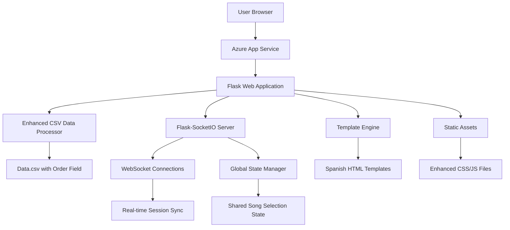

# Design Document: Song Order Enhancement

## Overview

The Song Order Enhancement extends the existing Musician Song Selector application with order-based functionality, next song display, and real-time global song selection synchronization. The solution integrates the new Order field from the CSV data, implements session synchronization using Flask-SocketIO for real-time updates, and provides comprehensive Spanish language support. The enhanced application maintains compatibility with Azure App Service while adding sophisticated real-time features for performance coordination.

## Architecture

### High-Level Architecture



### Technology Stack

- **Backend Framework**: Flask (Python 3.9+) with Flask-SocketIO extension
- **Real-time Communication**: Flask-SocketIO with WebSocket fallback to Server-Sent Events
- **Data Processing**: Enhanced CSV processor with order field support
- **Frontend Framework**: Bootstrap 5 with Socket.IO client library
- **Template Engine**: Jinja2 with Spanish translations
- **Deployment Platform**: Azure App Service with WebSocket support
- **Session Management**: Flask-SocketIO session handling with Redis backend (optional)

### Real-time Architecture

The application uses Flask-SocketIO for bidirectional real-time communication:
- **WebSocket Primary**: Full-duplex communication for instant updates
- **Server-Sent Events Fallback**: Unidirectional streaming for environments with WebSocket restrictions
- **Polling Fallback**: HTTP long-polling as final fallback for maximum compatibility
- **Azure Compatibility**: Configured for Azure App Service WebSocket support

## Components and Interfaces

### 1. Enhanced Data Processing Layer

**EnhancedCSVDataProcessor Class**
```python
class EnhancedCSVDataProcessor(CSVDataProcessor):
    def load_songs_with_order() -> List[OrderedSong]
    def get_song_by_order(order: int) -> Optional[OrderedSong]
    def get_next_song(current_order: int) -> Optional[OrderedSong]
    def get_songs_sorted_by_order() -> List[OrderedSong]
    def get_musician_songs_by_order(musician: str) -> List[OrderedSong]
    def validate_order_sequence() -> OrderValidationResult
```

**OrderedSong Data Model**
```python
@dataclass
class OrderedSong(Song):
    order: int
    next_song_id: Optional[str]
    previous_song_id: Optional[str]
```

### 2. Real-time Communication Layer

**SocketIO Integration**
```python
from flask_socketio import SocketIO, emit, join_room, leave_room

socketio = SocketIO(app, cors_allowed_origins="*", 
                   async_mode='eventlet',  # For Azure compatibility
                   logger=True, engineio_logger=True)

@socketio.on('join_global_session')
def handle_join_global_session(data)

@socketio.on('select_global_song')
def handle_global_song_selection(data)

@socketio.on('disconnect')
def handle_disconnect()
```

**Global State Manager**
```python
class GlobalStateManager:
    def __init__(self):
        self.current_song_id: Optional[str] = None
        self.connected_sessions: Set[str] = set()
        self.last_update_time: float = 0
    
    def update_global_song(self, song_id: str, session_id: str)
    def broadcast_song_change(self, song_id: str, exclude_session: str = None)
    def get_current_state(self) -> Dict
    def add_session(self, session_id: str)
    def remove_session(self, session_id: str)
```

### 3. Enhanced Web Application Layer

**New Routes and Endpoints**
```python
# Existing routes enhanced with order support
@app.route('/api/songs')  # Enhanced with order sorting
@app.route('/api/song/<song_id>')  # Enhanced with next song info
@app.route('/api/musician/<musician_id>')  # Enhanced with order sorting

# New routes for global functionality
@app.route('/global-selector')  # New global song selection interface
@app.route('/api/global/current-song')  # Get current global selection
@app.route('/api/global/set-song', methods=['POST'])  # Set global selection

# SocketIO event handlers
@socketio.on('join_global_session')
@socketio.on('select_global_song')
@socketio.on('request_current_song')
```

### 4. Enhanced Frontend Interface Layer

**New Components:**
- **Order Display**: Shows song order numbers in Spanish format
- **Next Song Widget**: Displays upcoming song with navigation link
- **Global Song Selector**: Real-time synchronized song selection interface
- **Connection Status Indicator**: Shows WebSocket connection state
- **Spanish Language Support**: All interface elements in Spanish

**Real-time JavaScript Integration:**
```javascript
// Socket.IO client integration
const socket = io();

// Global song selection handling
socket.on('song_changed', function(data) {
    updateGlobalSongDisplay(data);
    updateNextSongInfo(data);
});

// Connection status management
socket.on('connect', function() {
    updateConnectionStatus('connected');
});

socket.on('disconnect', function() {
    updateConnectionStatus('disconnected');
});
```

## Data Models

### Enhanced Song Data Structure

```python
@dataclass
class OrderedSong:
    # Inherited from Song
    artist: str
    song: str
    lead_guitar: Optional[str]
    rhythm_guitar: Optional[str]
    bass: Optional[str]
    battery: Optional[str]
    singer: Optional[str]
    keyboards: Optional[str]
    time: str
    song_id: str
    
    # New order-related fields
    order: int
    next_song_id: Optional[str]
    previous_song_id: Optional[str]
    
    def get_next_song_info(self) -> Optional[Dict]
    def get_order_display(self) -> str  # Returns "Orden: X"
```

### API Response Models

**Enhanced Song Details Response:**
```json
{
  "song_id": "miguel-mateos-cuando-seas-grande",
  "artist": "Miguel Mateos",
  "song": "Cuando Seas Grande",
  "time": "0:04:27",
  "order": 1,
  "assignments": {
    "Guitarra Principal": "LUISGAL",
    "Guitarra Rítmica": "JOHCES",
    "Bajo": "NICMON",
    "Batería": "JUAROD",
    "Voz": "NXTPAT",
    "Teclados": null
  },
  "next_song": {
    "song_id": "los-prisioneros-por-que-no-se-van-del-pais",
    "title": "Los Prisioneros - Por Qué No Se Van Del País",
    "order": 2
  }
}
```

**Global State Response:**
```json
{
  "current_song": {
    "song_id": "miguel-mateos-cuando-seas-grande",
    "title": "Miguel Mateos - Cuando Seas Grande",
    "order": 1,
    "assignments": { /* full assignment data */ },
    "next_song": { /* next song info */ }
  },
  "connected_sessions": 5,
  "last_updated": 1642678800
}
```

### Spanish Language Integration

**Translation Keys:**
```python
SPANISH_TRANSLATIONS = {
    # Order-related translations
    "order_label": "Orden",
    "next_song": "Siguiente canción",
    "no_next_song": "Última canción del repertorio",
    "song_order": "Orden de la canción",
    
    # Global selector translations
    "global_selector_title": "Selector Global de Canciones",
    "current_selection": "Selección actual",
    "select_song": "Seleccionar canción",
    "connection_status": "Estado de conexión",
    "connected": "Conectado",
    "disconnected": "Desconectado",
    "reconnecting": "Reconectando...",
    
    # Musician interface translations
    "songs_by_order": "Canciones por orden",
    "your_songs": "Tus canciones",
    "upcoming_songs": "Próximas canciones"
}
```

## Correctness Properties

*A property is a characteristic or behavior that should hold true across all valid executions of a system-essentially, a formal statement about what the system should do. Properties serve as the bridge between human-readable specifications and machine-verifiable correctness guarantees.*

### Prework Analysis

Let me analyze the acceptance criteria for testability:

<function_calls>
<invoke name="prework">
<parameter name="featureName">song-order-enhancement

### Property Reflection

After reviewing all properties identified in the prework analysis, I've identified several areas where properties can be consolidated to eliminate redundancy:

**Consolidation Areas:**
- Properties 1.1, 1.3, 3.2, and 3.4 all relate to consistent order display formatting - can be combined into one comprehensive display property
- Properties 1.2 and 3.1 both test sorting by order - can be combined into one sorting property
- Properties 2.1, 2.4, and 2.5 all relate to next song functionality - can be combined into one next song property
- Properties 5.1, 5.2, 5.3, 5.4, and 5.5 all relate to Spanish language consistency - can be combined into one comprehensive Spanish language property
- Properties 6.1, 6.2, 6.4, and 6.5 all relate to real-time synchronization behavior - can be combined into one synchronization property
- Properties 7.1, 7.2, 7.3, 7.4, and 7.5 all relate to order field processing - can be combined into one data processing property
- Properties 8.1, 8.2, and 8.3 all relate to performance timing - can be combined into one performance property

### Converting EARS to Properties

Based on the prework analysis and consolidation, here are the essential correctness properties:

**Property 1: Order Display Consistency**
*For any* song or musician assignment display, the order number should be included in Spanish format ("Orden: X") and consistently formatted across all interface elements.
**Validates: Requirements 1.1, 1.3, 3.2, 3.4**

**Property 2: Order-Based Sorting**
*For any* collection of songs (dropdown, musician assignments, etc.), they should be sorted by the Order field in ascending sequence, with invalid orders placed at the end.
**Validates: Requirements 1.2, 1.4, 3.1**

**Property 3: Next Song Calculation**
*For any* selected song with a valid order, the system should correctly identify and display the next song in sequence with proper navigation links, or indicate when no next song exists.
**Validates: Requirements 2.1, 2.2, 2.4, 2.5**

**Property 4: Global Session Synchronization**
*For any* global song selection change, all connected sessions should receive the update within 2 seconds and maintain consistent state, handling concurrent updates by using the most recent selection.
**Validates: Requirements 4.2, 4.5, 4.6, 6.1, 6.2, 6.4**

**Property 5: Complete Information Display**
*For any* song selection (local or global), the display should include complete song information, musician assignments, and next song details with proper Spanish formatting.
**Validates: Requirements 4.3, 4.4**

**Property 6: Spanish Language Consistency**
*For any* interface element, error message, or status display, Spanish language should be used consistently with proper terminology and formatting.
**Validates: Requirements 5.1, 5.2, 5.3, 5.4, 5.5**

**Property 7: Connection Status Management**
*For any* connection state change (connect, disconnect, reconnect), the system should provide appropriate visual feedback and attempt reconnection when needed.
**Validates: Requirements 6.3, 6.5**

**Property 8: Order Data Processing**
*For any* CSV data with order fields, the system should parse, validate, and maintain order information consistently, resolving conflicts deterministically.
**Validates: Requirements 7.1, 7.2, 7.3, 7.4, 7.5**

**Property 9: Performance Requirements**
*For any* data loading, synchronization, or calculation operation, the system should complete within specified time limits (3s for loading, 2s for sync, 1s for calculations).
**Validates: Requirements 8.1, 8.2, 8.3**

**Property 10: System Resilience**
*For any* partial connectivity or error scenario, the system should maintain functionality and provide appropriate Spanish error messages.
**Validates: Requirements 8.4, 8.5**

## Error Handling

### Real-time Communication Errors
- **WebSocket Connection Failures**: Graceful fallback to Server-Sent Events or polling
- **Session Synchronization Conflicts**: Last-write-wins strategy with conflict logging
- **Network Timeouts**: Automatic reconnection with exponential backoff
- **Broadcast Failures**: Retry mechanism with dead session cleanup

### Order Data Processing Errors
- **Missing Order Values**: Assign sequential values starting from max existing order + 1
- **Duplicate Order Values**: Resolve by adding fractional increments (e.g., 5.1, 5.2)
- **Invalid Order Types**: Convert to integers where possible, otherwise assign to end of sequence
- **Order Sequence Gaps**: Maintain gaps but ensure proper next/previous relationships

### Spanish Language Errors
- **Missing Translations**: Fallback to English with logging for missing keys
- **Encoding Issues**: Ensure UTF-8 encoding throughout the application
- **Format String Errors**: Validate translation parameters before rendering

### Azure App Service Compatibility
- **WebSocket Limitations**: Configure proper WebSocket settings for Azure
- **Session Persistence**: Use Redis or database backend for session storage if needed
- **Load Balancer Issues**: Implement sticky sessions for WebSocket connections

## Testing Strategy

### Dual Testing Approach

The application will use both unit testing and property-based testing to ensure comprehensive coverage:

**Unit Tests:**
- Test specific examples and edge cases (last song in sequence, invalid order values)
- Verify integration points between components (SocketIO events, data processing)
- Test error conditions and boundary cases (network failures, malformed data)
- Focus on concrete scenarios like specific song selections and Spanish translations

**Property-Based Tests:**
- Verify universal properties across all inputs using Hypothesis (Python property-based testing library)
- Test with randomly generated song data, order sequences, and user interactions
- Ensure properties hold across different data configurations and session states
- Minimum 100 iterations per property test to ensure thorough coverage

**Property Test Configuration:**
Each property-based test will:
- Run a minimum of 100 iterations with randomized inputs
- Be tagged with comments referencing the design document property
- Use the format: **Feature: song-order-enhancement, Property {number}: {property_text}**
- Generate realistic test data that matches the enhanced CSV structure with order fields

**Real-time Testing Strategy:**
- **WebSocket Testing**: Use SocketIO test client to simulate multiple concurrent sessions
- **Synchronization Testing**: Verify state consistency across multiple simulated clients
- **Performance Testing**: Measure actual timing for synchronization and calculation operations
- **Resilience Testing**: Simulate network failures and verify reconnection behavior

**Testing Framework:**
- **Unit Testing**: pytest for Python unit tests
- **Property-Based Testing**: Hypothesis for property-based tests
- **Real-time Testing**: python-socketio test client for WebSocket testing
- **Frontend Testing**: Selenium WebDriver for UI interaction testing with Spanish language validation
- **API Testing**: requests library for REST API endpoint testing

**Test Data Strategy:**
- Use the actual enhanced Data.csv file with Order field for integration testing
- Generate synthetic CSV data with various order scenarios for property testing
- Test with missing orders, duplicate orders, and invalid order values
- Ensure test data covers all instrument combinations and order sequences
- Create test scenarios with multiple concurrent users for synchronization testing

### Coverage Requirements

- **Code Coverage**: Minimum 90% line coverage for all Python modules
- **Property Coverage**: Each correctness property must have a corresponding property-based test
- **Integration Coverage**: End-to-end tests covering complete user workflows including real-time features
- **Spanish Language Coverage**: All Spanish translations must be tested for proper rendering and encoding
- **Real-time Coverage**: All SocketIO events and synchronization scenarios must be tested